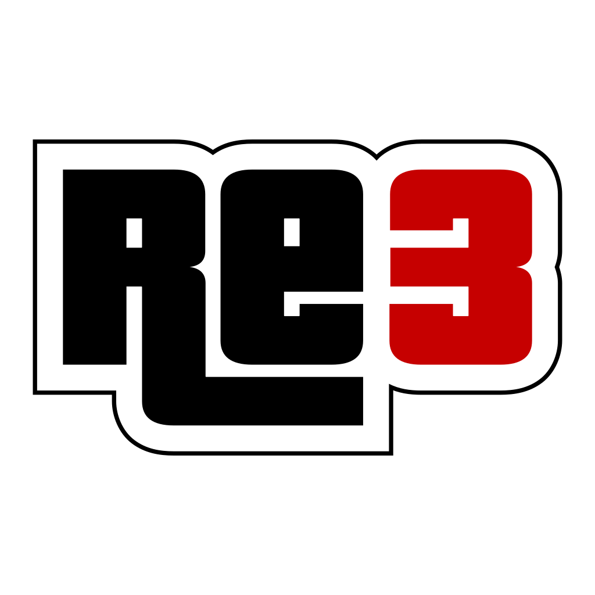

# re3-PS3

**re3 (GTA III) for the PlayStation 3**, as homebrew built with PSL1GHT.

re3 is the reverse-engineered source code of GTA III. This port runs it
natively on the PS3, with a hardware renderer on the RSX (a PS3 backend for
librw), DualShock 3 controls in the PS2 style, and the game's data read from
your own PC copy.

> **Status: 1.0 alpha.** All of the game's missions, the odd jobs and the
> collectibles have been run through the automatic test on real hardware
> without crashes, but it hasn't had long play-throughs yet. Expect bugs and
> please report them with the log (see [Troubleshooting](#troubleshooting)).
> Only tested on real consoles, not on RPCS3.

**No game data is included.** You need a legally purchased copy of GTA III
for PC. The PKG only has the program, its icon and two re3 files (the
PlayStation button icons and the controller picture of the settings page).

## Features

- Native 720p, rendered on the RSX: tiled colour/depth buffers, compressed
  depth and ZCULL, 60+ fps of headroom in the heavy scenes (rain and smoke).
- **30 fps** by default (the rate the game was made for) or **60 fps**:
  *Options > Graphics > Frame rate*. Always in sync with the TV (no tearing).
- PS2-style controls with lock-on aiming, four pad setups, button
  redefinition, inverted look, free camera (*Controller setup > Gamepad
  settings*). PlayStation buttons in the on-screen help.
- **Map** in the pause menu, Vice City style: the game's radar tiles, every
  safehouse, Ammu-Nation, Pay 'n' Spray and bomb shop, waypoints with X.
- **MP3 player radio**: put `.mp3` files in `USRDIR/mp3`.
- **Skins**: put `.bmp` skins in `USRDIR/skins`, choose them in *Player setup*.
- *Display > Screen size* for overscan, fixed aspect ratios shown with black
  bars, FPS counter (*Graphics > Show FPS*).
- Settings saved in `USRDIR/re3.ini`, saves in `USRDIR/userfiles`.

## Installation

1. Install `re3-ps3-1.0-alpha.pkg` on a PS3 with homebrew support (CFW or
   HEN), e.g. copy it by FTP and install it with the package manager. It
   appears in the XMB as **re3**.
2. The PKG creates `/dev_hdd0/game/RE3PS3000/USRDIR` with these empty
   folders. From your GTA III PC installation, copy into them (by FTP):

   | Folder  | Contents                                   |
   |---------|--------------------------------------------|
   | `anim`  | the PC game's `anim` folder                |
   | `audio` | the PC game's `audio` folder (big: radio)  |
   | `data`  | the PC game's `data` folder                |
   | `models`| the PC game's `models` folder (keep the two re3 `.txd` already there) |
   | `text`  | the PC game's `text` folder                |
   | `txd`   | the PC game's `txd` folder (loading screens) |
   | `mp3`   | optional: your own music                   |
   | `skins` | optional: player skins (`.bmp`)            |

   Folder and file names may be in any letter case, as on the PC.
3. Start **re3** from the XMB.

## Mods

Anything made for the PC version of GTA III as data files works:

- TXD textures (loose in `models`/`txd`, or inside `gta3.img` with an IMG
  tool on the PC, then copy `gta3.img` and `gta3.dir`): HD loading screens,
  HUD, fonts, vehicles, peds, buildings. All PC formats are read
  (palettized, 16/32 bit, DXT1/3/5).
- DFF models in GTA III PC format, inside `gta3.img`.
- Data files (`handling.cfg`, `carcols.dat`, `timecyc.dat`, `gta3.dat`...)
  and a modified `main.scm`.

Limits: on the PS3 every texture is kept uncompressed (4 bytes per pixel) in
the RSX's 216 MB, so a pack that raises *everything* to 1024×1024 can run
out of video memory (models get dropped, textures turn white). The largest
texture size is 4096×4096. Code mods (CLEO, ASI, plugins that patch the
executable) and unconverted assets from other games or platforms don't work.

## Troubleshooting

- The log is `USRDIR/re3-ps3.log` (the previous one: `re3-ps3.old.log`).
  Send it with any report: it says what the game was doing when it crashed.
- A black screen at start: create an empty `USRDIR/notiles.txt` (turns off
  the tiled buffers), and report it.
- `USRDIR/autotest.txt` runs an automatic test while you watch (load a save
  outdoors first). One line in it chooses the test: nothing (weather, a
  flight over the islands, save/load, side missions, garages), `mode=full`
  (every mission 30 s, odd jobs, rampage, collectibles — it changes the
  game's progress, don't save after it), `mode=gpu` (GPU benchmark),
  `mode=rain`, `mode=leak`. The file is renamed to `autotest.done.txt` when
  the test ends.

## Building

On Linux or WSL (Ubuntu):

1. Install the PS3 toolchain and PSL1GHT (https://github.com/ps3dev/ps3toolchain),
   which ends up in `/usr/local/ps3dev`.
2. Build:

   ```sh
   git clone https://github.com/stingziz0u/re3-PS3.git
   cd re3-PS3
   export PS3DEV=/usr/local/ps3dev PSL1GHT=/usr/local/ps3dev
   export PATH=$PS3DEV/bin:$PS3DEV/ppu/bin:$PATH
   make -C ps3 -j$(nproc)
   make -C ps3 verify
   ```

   The result is `ps3/re3-ps3-1.0-alpha.pkg`.

Other targets: `make -C ps3 DEBUG=1` (debug build with asserts),
`make -C ps3 STAGE=1` (headless test build: loads the game without video,
audio or pad, everything to the log), `make -C ps3 clean`.

The RSX shaders are in the tree already compiled
(`vendor/librw/src/ps3/ps3shaders.h`). To change them you need NVIDIA's `cgc`
and PSL1GHT's `cgcomp` with `cgcomp-relative-constants.patch`; see
`vendor/librw/src/ps3/shaders/build_shaders.sh`.

### Where things are

- `ps3/` — Makefile, PKG icon, patch level.
- `src/skel/ps3/` — platform layer: main loop, file system, pad, log, test.
- `src/audio/sampman_ps3.cpp` — audio (software mixer on libaudio, MP3/WAV streams).
- `vendor/librw/src/ps3/` — librw's RSX backend: VRAM, rasters, pipelines, shaders.
- `src/core/config.h` (`__PS3__` section) — what the PS3 build turns on and off.

## Credits

- The [re3 team](https://github.com/GTAmodding/re3) for re3, and aap for
  [librw](https://github.com/aap/librw).
- The [ps3dev](https://github.com/ps3dev) people for ps3toolchain and PSL1GHT.
- lieff for [minimp3](https://github.com/lieff/minimp3).

The original re3 README is kept as [README.re3.md](README.re3.md).

## License

See [LICENSE](LICENSE). Grand Theft Auto III is © Rockstar Games /
Take-Two Interactive. This project is not affiliated with or endorsed by
Rockstar Games, Take-Two Interactive or Sony Interactive Entertainment.

## AI disclosure

This project's code was written collaboratively with Claude (Anthropic),
working through this port with me in real time over many sessions. Every
bit of testing and debugging was done by me on real hardware.
